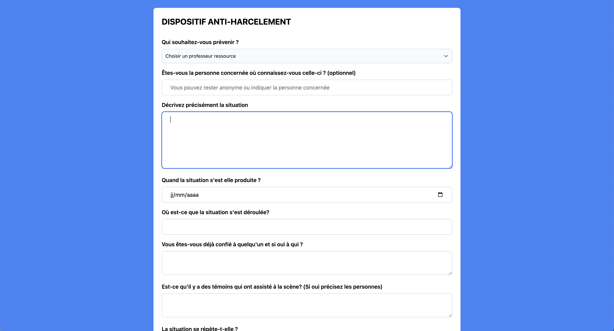
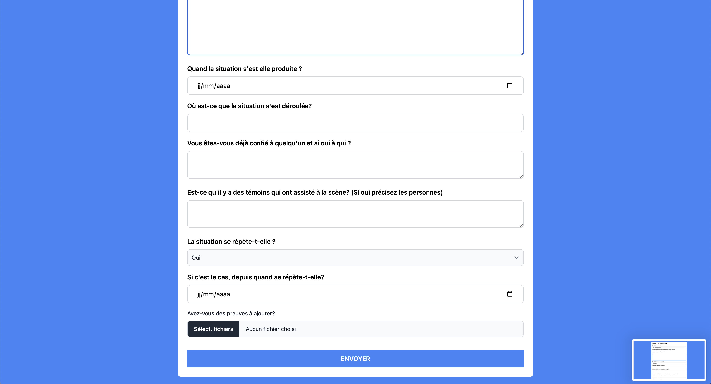

# 📘 Anti-Bullying Reporting App

A React TypeScript application to anonymously and safely report school bullying incidents.

> 🛠️ Built with **React**, **TypeScript**, and **Tailwind CSS**

---

## 🎯 Purpose

This application allows a student or witness to:
- Alert a designated teacher
- Accurately describe the incident
- Stay anonymous if they wish
- Attach any relevant evidence

---

## 📸 App Preview



---



---

## 🧩 File Structure

```
src/
├── App.tsx               # Main component
├── constants/
│   └── teacher.ts        # List of designated teachers
```

---

## 📄 Example content for `src/constants/teacher.ts`

```ts
const teachers = [
  "Ms. Dupont",
  "Mr. Martin",
  "Ms. Lefèvre",
  "Mr. Bernard"
]

export default teachers
```

---

## 🚀 Getting Started

### 1. Clone the project

```bash
git clone https://github.com/your-username/anti-bullying-app.git
cd anti-bullying-app
```

### 2. Install dependencies

```bash
npm install
```

### 3. Start the development server

```bash
npm run dev
```

---

## ✅ TODO

- [ ] Connect to a secure backend
- [ ] Actually send the form (via email or API)
- [ ] Add a success confirmation step
- [ ] Improve accessibility (a11y)

---

## 💡 Notes

- The user can remain **completely anonymous**
- The form is designed to be quick and easy to complete
- No data is submitted without user confirmation

---

## 🛡️ Privacy & License

This is a demo version — no personal data is collected or stored.

---

## 👩‍🏫 Contributors

Made with ❤️ to raise awareness and protect students.